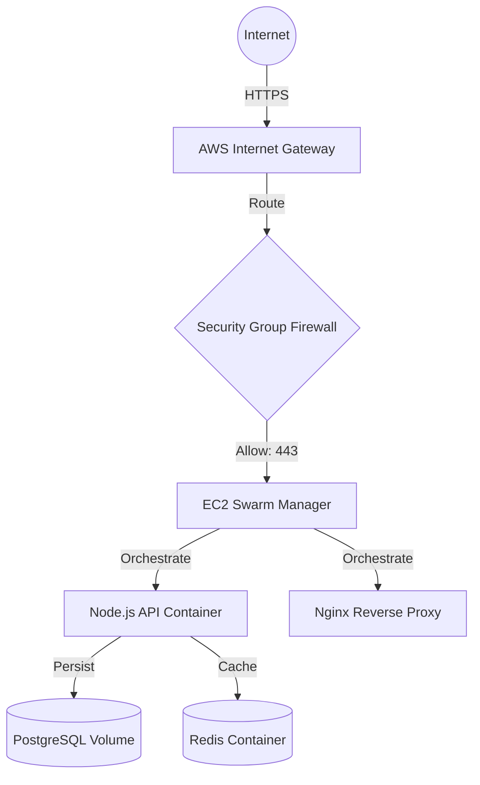

#  AWS Logistics Infrastructure (IaC)

**Infrastructure as Code (IaC) repository for deploying the TransitCore microservices stack via Docker Swarm on AWS.**

This repository automates the provisioning of secure, immutable infrastructure using **Terraform** and manages deployment pipelines via **GitHub Actions**.

##  Cloud Architecture



## Deployment Strategy

* **Immutable Infrastructure:** Servers are configured via `user_data` boot scripts.
* **Security Hardening:** SSH access (Port 22) is restricted strictly to the Admin VPN IP via Terraform rules.
* **Orchestration:** Docker Swarm manages container health and restarts failed services automatically.

## Tech Stack

* **Provisioning:** Terraform (HCL)
* **Cloud Provider:** AWS (EC2, VPC, Security Groups)
* **Orchestration:** Docker Swarm
* **CI/CD:** GitHub Actions

## Usage

### 1. Provision Infrastructure

```bash
cd terraform
terraform init
terraform apply -auto-approve

```

### 2. Deploy Stack

```bash
docker stack deploy -c docker-compose.yml transit_stack

```

```

### **Final Status**
Your repo will now have:
* `terraform/main.tf` (The AWS proof)
* `.github/workflows/deploy.yml` (The Automation proof)
* `docker-compose.yml` (The Container proof - already there)
* `README.md` (The Diagram)

**Do this now.** This repo is the key to proving the "DevOps" skills listed on your resume.

```
